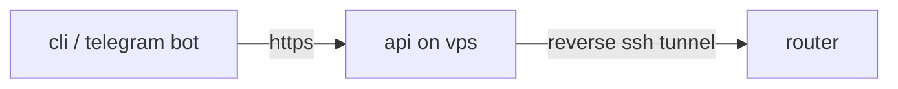

<div align="center">

# router-toggle

remote control for xray-based routers - toggle game ports, vpn and per-site routing in one tap


</div>

## how it works



clients never see router credentials - only a personal access code that opens exactly one router. routers keep permanent reverse tunnels to the vps, so no public ip or port forwarding is needed at home

## features

- **game ports** - proxy steam / faceit eu udp traffic on demand
- **vpn switch** - turn proxying off until the next reboot, for banking and local services
- **sites via vpn** - add any [v2fly](https://github.com/v2fly/domain-list-community) service by name, or a single domain
- **health check** - router, internet, proxy service and vpn link at a glance
- **reboot** - with confirmation and a cooldown
- **manual mode** - direct ssh to your own router, no server involved

every change is applied atomically: temp file → syntax check → backup → `mv` → restart → read-back → rollback on mismatch

## getting started

download the binary for your system from [releases](../../releases) and run it. enter the access code from your administrator - it is asked once and remembered

<details>
<summary><b>macos</b> - "cannot be opened"</summary>

right-click the file → open → open. or in terminal:

```sh
xattr -dr com.apple.quarantine router-toggle-darwin-arm64
```
</details>

<details>
<summary><b>windows</b> - smartscreen warning</summary>

click more info → run anyway
</details>

## manual mode

cli only. confirm the host key fingerprint on first connect and review a diff before every change

<details>
<summary>supported router configs</summary>

**openwrt** — nft tproxy rule in `/etc/rc.local`:

```sh
nft 'add rule ip xray prerouting ip saddr 192.168.1.0/24 udp dport { 443, 3478 } tproxy to :1083 meta mark set 1'
```

**keenetic / xkeen** — `/opt/etc/xkeen/port_proxying.lst` and a `vless-reality` udp rule in `/opt/etc/xray/configs/05_routing.json`

if the config doesn't match, nothing is changed
</details>

## self-hosting

<details>
<summary><b>server</b></summary>

```sh
make server
scp rt-server root@vps:/usr/local/bin/
```

`/etc/router-toggle/config.json` (mode `600`):

```json
{
  "listen": "127.0.0.1:8080",
  "db_path": "/etc/router-toggle/router-toggle.db",
  "server_key": "<openssl rand -hex 32>",
  "admin_code": "<16+ chars: A-Z without I/O, digits 2-9>",
  "public_ip": "<this server's ip>",
  "telegram_token": "<admin bot token>",
  "telegram_chat_id": "<your chat id>"
}
```

runs as a systemd service. `dlc.dat` is downloaded on first start and refreshed every sunday at 06:10
</details>

<details>
<summary><b>nginx</b> - sharing port 443 via sni</summary>

```nginx
stream {
    map $ssl_preread_server_name $backend {
        rt.example.com rtapi;
        default        xhttp;
    }
    upstream rtapi { server 127.0.0.1:8444; }
}

http {
    server {
        listen 127.0.0.1:8444 ssl;
        server_name rt.example.com;
        ssl_certificate     /etc/letsencrypt/live/rt.example.com/fullchain.pem;
        ssl_certificate_key /etc/letsencrypt/live/rt.example.com/privkey.pem;
        location /v1/ { proxy_pass http://127.0.0.1:8080; proxy_read_timeout 180s; }
        location /    { return 404; }
    }
}
```
</details>

<details>
<summary><b>routers</b></summary>

add a router from the cli or admin bot with its tunnel port and ssh password - the server pins the host key on first connect and returns the client access code

user-added sites live in a dedicated place and never touch hand-written config:

- **keenetic** - a separate routing rule with `"ruleTag": "added-by-user"`
- **openwrt** - a `# added by user` section, which must stay last in `/etc/dnsmasq.servers`
</details>

<details>
<summary><b>admin bot</b></summary>

```sh
cd bot && python3 -m venv venv && venv/bin/pip install -r requirements.txt
cp .env.example .env   # token, admin code, allowed user ids
```

replies only to allowed user ids. adds and renames routers, shares client links, receives failure alerts
</details>

<details>
<summary><b>backups & migration</b></summary>

`deploy/rt-backup.sh` sends a weekly archive to the admin bot. moving to a new vps is one script and a dns switch - see [deploy/MIGRATION.md](deploy/MIGRATION.md)
</details>

## development

```sh
make test      # go test ./...
make run       # client with api address from .env
make server    # linux/amd64 server binary
make release   # clients for all platforms + checksums
```

```
cmd/rt-server        api server
cmd/router-toggle    cli client
internal/router      firmware controllers and apply protocol
internal/geosite     v2fly dlc.dat reader
internal/sshconn     ssh with host key pinning
bot/                 admin telegram bot
deploy/              backup, restore, migration
```
